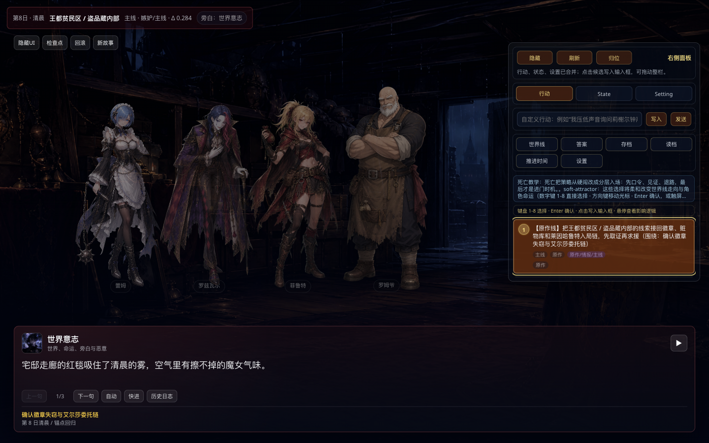

# Open-World Visual Novel Agent Engine

[中文](#中文) | [English](#english)

## 中文

这是一个基于 SillyTavern 扩展开发的开放世界视觉小说 Agent/RAG 引擎。它的目标不是写死固定剧本，而是让大模型像“小说导演”和“世界模拟器”一样工作：读取世界观、角色状态、剧情因果、存档记忆和玩家行动，再生成可点击推进的视觉小说舞台内容。

本仓库用于公开协作和接续开发，保留框架、核心代码、测试、Agent/RAG 模块和可公开发布的本地素材；不会提交 API key、玩家存档、聊天记录、运行日志或私有语料。

## Preview



## 核心功能

- 在 SillyTavern 中运行视觉小说舞台。
- 将模型输出解析为旁白、台词、舞台段落和候选行动。
- 使用多层 RAG 支持剧情记忆、世界规则、因果推演、路线牵引和存档记忆。
- 根据当前文本队列映射背景、角色、立绘、动作差分和 UI 演出。
- 支持原作吸引线、自由探索线、IF 分支线和世界逻辑模拟。
- 提供测试脚本验证 RAG、Agent、素材索引、UI 绑定和发布安全。

## 快速开始

```bash
npm install
node server.js --disableCsrf --browserLaunchEnabled=false
```

打开：

```text
http://127.0.0.1:8000/?re0_recover=1&api_guard=1
```

然后在 SillyTavern 中配置你的模型 API。API key 只应保存在本地。

## 项目结构

```text
public/scripts/extensions/third-party/re0-adventure-engine/
  index.js                         主运行时
  style.css                        视觉小说 UI
  data/                            Agent、RAG、VN、素材策略模块
  assets/                          运行素材

scripts/                           构建、索引、验证脚本
tests/                             模块测试与 E2E 测试
docs/images/                       README 预览图
```

## 工作原理

核心循环是：

1. 读取玩家行动、世界状态、角色状态和存档记忆。
2. 从 RAG 检索相关剧情因果、世界规则和路线牵引。
3. 调用模型生成小说正文和结构化视觉小说台本。
4. 解析为可点击推进的文本队列。
5. 按当前显示文本驱动舞台背景、角色、立绘和动作。
6. 生成下一组候选行动，并把本轮结果压缩写入存档记忆。

设计原则：开放世界优先，因果逻辑约束；原作行动有强牵引，自由行动按世界规则推演。

## 验证

```bash
npm run re0:check
node tests/re0-story-rag.test.mjs
node tests/re0-agent-module.test.mjs
node scripts/re0-release-check.mjs
```

真实端到端测试会调用本地模型 API：

```bash
npm run re0:e2e:real-ui-fullflow
```

## 发布注意

不要提交：

- API key 或任何密钥
- `data/default-user`
- 玩家存档、聊天记录、备份、日志
- 原始小说全文或大型私有语料库
- 没有授权发布的第三方素材

## English

This is an open-world visual novel Agent/RAG engine built as a SillyTavern extension. Instead of hard-coding a fixed script, it lets the model act as a story director and world simulator: it reads lore, character state, causal memory, save memory, and player actions, then generates playable visual novel scenes.

The repository is prepared for public collaboration. It keeps the framework, runtime code, tests, Agent/RAG modules, and publishable local assets, while excluding API keys, player saves, chat logs, runtime logs, and private corpus data.

## Features

- Runs a visual novel stage inside SillyTavern.
- Parses model output into narration, dialogue, stage beats, and candidate actions.
- Uses layered RAG for story memory, world rules, causal reasoning, route attraction, and save memory.
- Maps the current text queue to backgrounds, characters, portraits, sprite variants, and UI performance.
- Supports canon attraction, free exploration, IF branches, and world-logic simulation.
- Includes tests for RAG, Agent contracts, asset indexes, UI bindings, and release safety.

## Quick Start

```bash
npm install
node server.js --disableCsrf --browserLaunchEnabled=false
```

Open:

```text
http://127.0.0.1:8000/?re0_recover=1&api_guard=1
```

Configure your model API inside SillyTavern. Keep API keys local.

## Architecture

The core loop:

1. Read player action, world state, character state, and save memory.
2. Retrieve relevant causal facts, world rules, and route signals from RAG.
3. Ask the model to generate prose plus a structured visual novel script.
4. Parse the result into a clickable text playback queue.
5. Drive stage backgrounds, characters, portraits, and actions from the currently displayed text.
6. Generate the next candidate actions and compress the turn result into save memory.

Principle: open world first, constrained by causal logic. Canon actions create strong attraction; free actions are simulated through world rules.

## License

This project is based on SillyTavern and follows AGPL-3.0. Keep upstream license notices when redistributing.
